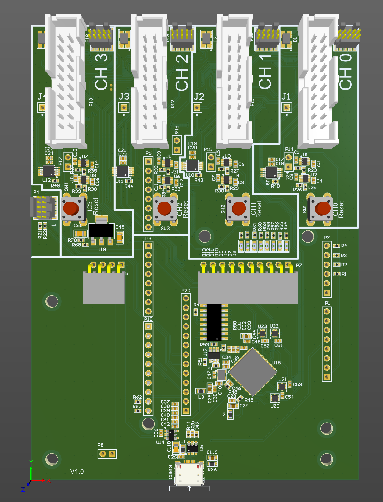
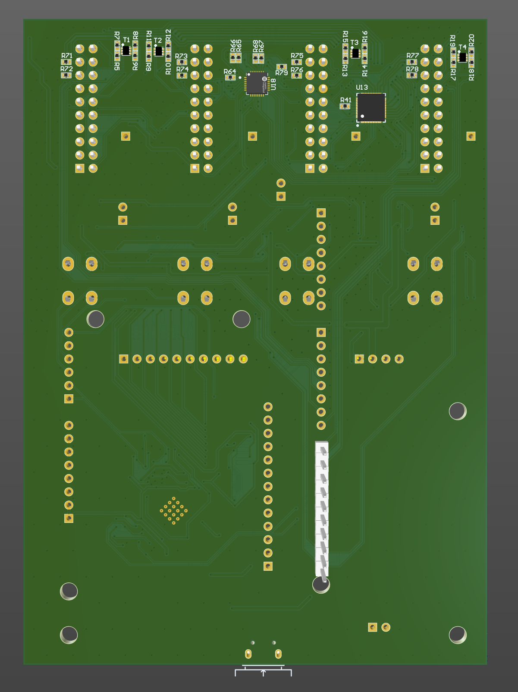

# nRF Test Device

# Summary

nRF Test Device, designed by [IRNAS](https://irnas.eu/)

---

## Specifications

### General Specifications

## Firmware

[Source](https://github.com/IRNAS/nrf-test-tool)

## Bill of Materials

[Fireblitz BOM](https://hub.allspice.io/IRNAS/irnas-nrf-test-tool-hardware/src/branch/main/03_DOC/nRF-TestDevice_BOM)

## Letest Hardware release

[Baseplate V1.0](https://hub.allspice.io/IRNAS/irnas-nrf-test-tool-hardware/releases)